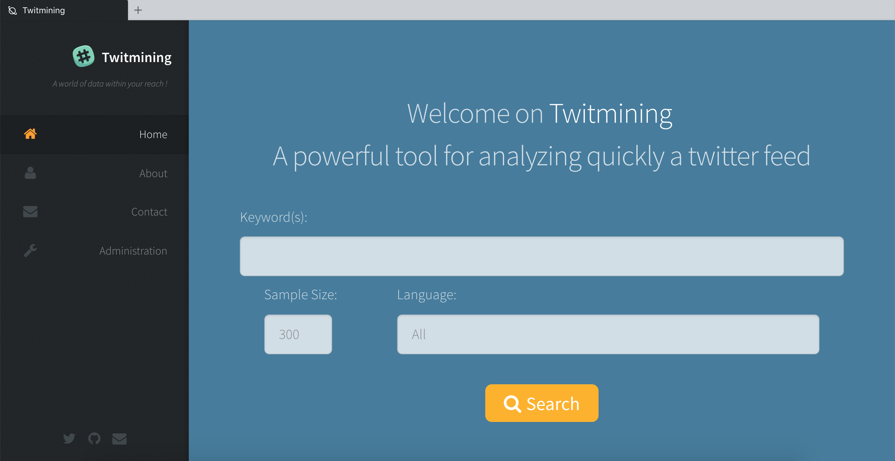
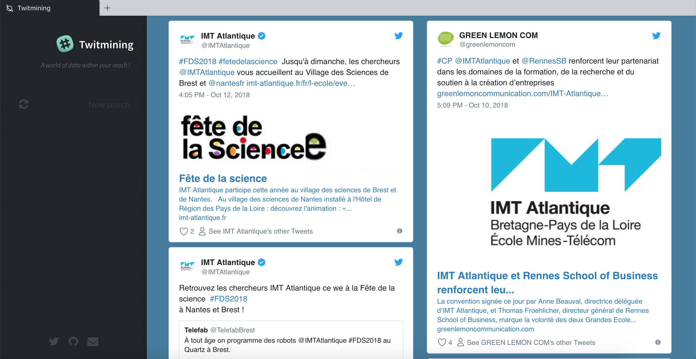

# Twitmining

This is a web application of data mining for analyzing a twitter feed using keywords developed using django python framework.

## Project introduction

In an athletic sprint competition, getting a bad start often jeopardizes the good course of the race. The same is true for crisis management: the first few hours of operation determine the success of subsequent operations. However, making the right decisions early on is difficult because the information is fragmented, incomplete and even false. In this purpose, the use of social networks like Twitter is a new source of information. Indeed, when disasters occur, witnesses and victims quickly disseminate massive but not always reliable or easy to interpret information on this social network.

Imagine that it is possible to capture this information, to keep only the parts related to a situation and to evaluate the relevance of the information by crossing. This would potentially provide a formidable tool to inform the tactical and strategic decisions of rescue teams. This type of data mining is already widely used in many contexts. The objective of this project is to demonstrate this concept.

## How to use

Just enter your keyword in the search bar as you can see below. Then, the web application will do the remaining work by requesting twitter API, sort all received tweets by relevance and display it to you with a timeline of relevant tweets :

&nbsp;
